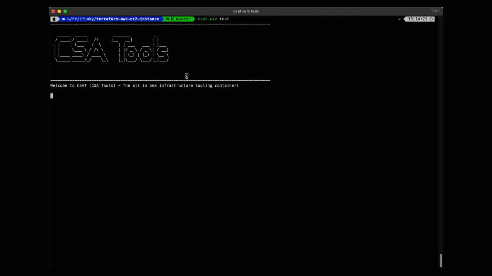

# Cloud Security Arcitect Tools (CSAT)

CSAT contains a mixture of best practice development and infrastructure tools for use by Wizards that can be used locally and as part of a CI/CD process.

**Why CSAT?**

- Security - Use best practices with IAM Assume Role, no clear text keys
- Consistency - Just spin up a container and use the right tool versions
- Extensible - Use the tools the way you want or add new ones

**What Can I do With CSAT?**
- Use it locally instead of installing lots of individual tools
- Use it in your CI infrastructure pipeline

## Features

- Uses Docker-out-of-Docker which uses your host docker installation with just the cli tools running in the tooling container
- Mounts your `.ssh` and `.aws` folders
- Mounts the current folder to `data` within the running container

**What's in the box?**

Languages

- Python v3.10.5
- Ruby v3.0.4
- Go 1.17.10
- Node v17.9.0 (npm)
-> Why multiple languages? This enables us to use best of breed tools regardless of what they're written in.


## Tools

**Wiz-Cli**

Wiz-cli is a locally deployed command line tool that helps you detect and prevent security misconfigurations and vulnerabilities early in the development cycle.

**Terraform**

Our tool of choice for infrastructure as code.

**TFLint**

Tool for linting Terraform code.

**Checkov**

Static code analysis tool for infrastructure-as-code for security best practices

**Conftest**

Utility to help you write tests against structured configuration data.

**Terraform-Inspect-Config**

Helper library for extracting high-level metadata about Terraform modules from their source code.

https://github.com/hashicorp/terraform-config-inspect

**AWS CLI**

AWS command line tool (with bash auto) if we need to do any adhoc checks

**Inspec**

Multi cloud testing tool for continuous compliance and testing of infrastructure

**Yeoman**

A scafolding framework used for creating new projects.

https://yeoman.io/

**Gomplate**

Gomplate is a template renderer which supports a growing list of datasources, such as: JSON (including EJSON - encrypted JSON), YAML, AWS EC2 metadata, BoltDB, Hashicorp Consul and Hashicorp Vault secrets.

https://github.com/hairyhenderson/gomplate

**Boto3**
Python 3 AWS framework

**YamlLint**
Python YAML linting tool

**Packer**
Hashicorp Packer for building images

**Helm**
K8S packaging manager

**Kubectl**
Command line tool for controlling Kubernetes clusters

**AWS-IAM-Authenticator**
A tool to use AWS IAM credentials to authenticate to a Kubernetes cluster

**EKSCtlr**
A simple CLI tool for creating clusters on EKS - Amazon's new managed Kubernetes service for EC2. It is written in Go, and uses CloudFormation
## Getting Started

### Docker Registry

**NOTE:** Currentlty we are looking for a registry home :-). For now build the container locally from the root of the cloned repo.

```bash
$ make build
```

**Optional Local Setup (IAM Keys)**

If you're still using IAM keys then the following workflow provides a secure process to use CSAT locally whilst not exposing IAM credentials in plain text.

We've tried to keep the setup minimal so here are the pre-requisites to get going with CSAT. Primarily this has been designed to be run under Linux/Mac but will also work on Windows.

 **MAC**

You can use something like https://www.leapp.cloud/ to manage your CSP credentials which stores your sensitive data in the OS keychain never exposing secrets in clear text files.

Using Leap as an example with AWS:



After starting a new session Leapp will auto populate `.aws/credentials` with temporary credentials which are ready to be passed into the CSAT container.

### Useful Helpers - Create a Shell Alias

To make your life easier create a shell alias, for example you can add the following to your shell:

    $ vim ~/.zshrc
    function csat() {
            docker run -it --rm \
            -e AWS_ACCESS_KEY_ID \
            -e AWS_SECRET_ACCESS_KEY \
            -e AWS_SESSION_TOKEN \
            -e AWS_SECURITY_TOKEN \
            -e AWS_DEFAULT_REGION=us-east-1 \
            -e WIZ_ENV=$1 \
            -v "$PWD:/data" \
            -v ~/.ssh:/root/.ssh \
            -v ~/.aws:/root/.aws \
            -v /var/run/docker.sock:/var/run/docker.sock \
            wiz-sec/csatools:latest
    }


Then from your shell call `csat` passing in the name of a profile from .aws/config:

```bash
$ csat test
```

## 

# Using CSAT

Here are some examples of using CSAT as part of your day to day routine once you have authenticated
 - The current folder where you run the commands are mounted to */data*

### Wiz

Internally at Wiz we use different tenants that we must authorise against before running any `wiz-cli` commands.  The following example will show how we can run an IAC Terraform scan using CSAT.

Available tenants:

| Name | Description                 |
| ---- | --------------------------- |
| test | Test tenant for use by CSAs |
| demo | For use on the demo tenant  |

Given you have the useful shell functions setup from above the following will show connecting to the `test` tenant: 

```bash
$ csat-wiz test # drop into the CSAT shell ready for connecting to test
> wizcli auth --id <YOUR-ID> --secret <YOUR-SECRET>
> wizcli iac scan --path /data
```


**AWS Command Line**

In this scenario you might just need to run some AWS CLI commands.
From any folder run the following:


Once in the PolyDev shell start typing AWS commands - with tab completion :-)

```bash
aws s3 ls
```

**Terraform Workflow**

In this scenario you can use CSAT to perform Terraform linting, validation during module development.  You could also run Terraform apply but we don't recommend this and rather a CI/CD pipeline should be implemented.

From your Terraform folder enter the CSAT shell and run Terraform commands:

```bash
$ cd /projects/my_terraform_module
$ csat

> terraform init
> terraform validate
> tflint --aws-region=eu-west-1
```

> NOTE : It is recommended to wrap Terraform commands in a Makefile giving you a CI/CD tool agnostic way of creating a pipeline that can run Terraform

## Customise
Update the motd with your own name: https://patorjk.com/software/taag/#p=display&f=Big&t=CSA%20Tools

